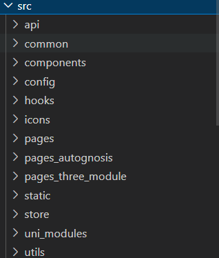
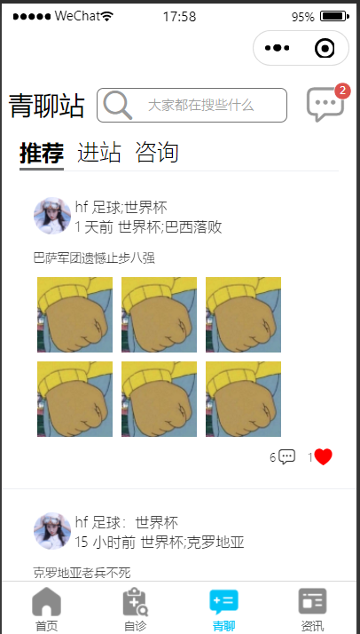
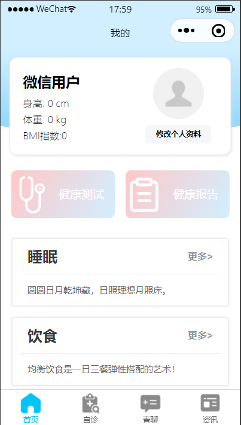

# Health Yourself

## 简介

这是一个基于SpringCloudAlibaba，uni-app的前后端分离的医疗论坛系统，提供小程序界面+后台服务的整套系统源码。

- 你可以拿它作为前端uni-app学习的练手教程；
- 你也可以把它作为SpringCloudAlibaba服务化思想的学习项目；
- 你也可以拿它作为当下火热的ElasticSearch,Redis,RabbitMQ的学习Demo;
- 你也可以将其视为一个前后端分离的项目实践；
- ...

## 使用技术

- SpringBoot 2.6.3 后台基本框架
- uni-app 前端基本框架
- ElasticSearch 搜索层
- RabbitMQ 消息队列
- Redis 缓存层
- Swagger 文档
- Mybaits-Plus 好用的mybatis框架
- lombox getter setter插件
- druid 数据库连接池


## 模块分层

### 服务端

```shell
health-backend
├── health-common   # 公共模块
│   ├── pom.xml
│   └── src
├── health-gateway # 网关
│   ├── pom.xml
│   └── src
├── health-community   # 社区论坛模块
│   ├── pom.xml
└── └── src
├── health-consult # 咨询模块
│   ├── pom.xml
│   └── src
├── health-diet # 饮食模块
│   ├── pom.xml
│   └── src
├── health-community   # 会员模块
│   ├── pom.xml
└── └── src
├── health-search   # 搜索模块
│   ├── pom.xml
└── └── src
├── health-search   # 自诊模块
│   ├── pom.xml
└── └── src
├── health-sport # 睡眠模块
│   ├── pom.xml
└── └── src
├── health-sport # 运动模块
│   ├── pom.xml
└── └── src
```

### 前端

health-mp

基于uni-app



## 项目部署

### 服务端

项目后端环境

- JDK1.8
- Mysql8
- Redis6
- IDEA编译器
- Lombox插件（百度一下）
- ElasticSearch 7.×
- RabbitMQ 
- IDEA编译器

部署步骤：

1. 创建数据库health-×，导入health-×.sql
2. 修改里的application-*.yml的数据库连接、redis连接、ElasticSearch连接、RabbitMQ连接
3. 导入项目，并且运行

### 前端

前端环境：

- Node.js v16.13.2
- VsCode

部署步骤：

1. 导入项目，运行 npm i --legacy-peer-deps
2. 启动项目：npm run dev:mp-weixin
3. 微信开发者工具

## 界面预览





## 碎碎念

如果是初学Java的朋友也可以跟着流程借鉴这些代码，试着实现这个项目，相信能对你的成长有所帮助！

如果有心，不妨请博主喝杯茶::laughing::


最后的最后，如果你有任何不懂疑问，欢迎添加**扣扣**咨询群【417094004】，开源不易，一定要给我==Star==哦！！